# League Jungle Draft Assistant

A real-time **League of Legends Solo/Duo draft assistant** that reads Champion Select from the local League Client, analyzes both team compositions, and ranks a configurable jungle champion pool according to how well each pick completes the allied team and answers the enemy draft.

The project is designed around a simple idea:

> **Do not ask which jungler is strongest in general. Ask which jungler makes this specific draft better.**

---

## Example

```text
========================================
           JUNGLE ASSISTANT
========================================
ALLY:  Lucian | Akali | Garen | Milio
ENEMY: Vi | Volibear | Blitzcrank | Kai'Sa | Lux

--- CONSIGLIO ---
1. Amumu        73
2. Fiddlesticks 72
3. Jarvan IV    71
4. Graves       68
5. Lee Sin      63
6. Evelynn      57
========================================
```

The ranking is recalculated automatically whenever Champion Select changes.

---

## Features

- Real-time Champion Select detection
- Automatic League Client reconnection
- Allied and enemy draft analysis
- Strategic dataset for the current champion roster
- Physical / magic / mixed damage classification
- Nine curated strategic metrics on a `0–5` scale
- Allied team deficit analysis
- Enemy composition adaptation
- AD/AP balance evaluation
- Explainable scoring with optional debug breakdown
- Compact terminal output for use during ranked games
- Scenario-based stress tests for scoring calibration

---

## How it works

```mermaid
flowchart TD
    A[League Client] --> B[LCU reader]
    B --> C[Draft parser]
    C --> D[Champion profiles]

    E[SQLite strategic database] --> D

    D --> F[Allied composition analysis]
    D --> G[Enemy composition analysis]

    F --> H[Candidate jungler simulation]
    G --> H

    H --> I[Scoring engine]
    I --> J[Ranked jungle recommendations]
```



The application does **not** try to determine the universally strongest champion.

For every candidate jungler, it estimates:

1. What the allied composition is currently missing.
2. How much that jungler fills those gaps.
3. How suitable that jungler is against the enemy composition.
4. Whether the pick improves the team's physical/magic damage balance.

---

## Current jungle pool

The default pool currently contains:

- Lee Sin
- Amumu
- Jarvan IV
- Graves
- Evelynn
- Fiddlesticks

The pool is intentionally small because the original goal of the project is to support an actual Solo/Duo champion pool rather than rank every possible jungler.

It can be expanded later.

---

## Strategic champion model

Each champion has nine strategic attributes rated from `0` to `5`.

| Metric | Meaning |
|---|---|
| `engage` | Ability to reliably start a fight |
| `frontline` | Ability to absorb pressure and create space |
| `peel` | Ability to protect allied carries |
| `disengage` | Ability to stop or reset an unwanted fight |
| `pick_potential` | Ability to catch isolated or mispositioned targets |
| `poke` | Ability to deal meaningful damage before a committed fight |
| `dps` | Sustained damage during extended fights |
| `burst` | Damage concentrated into a short time window |
| `objective_control` | Contribution to taking, securing and contesting objectives |

### Scale

| Score | Interpretation |
|---:|---|
| 0 | Practically absent |
| 1 | Very limited / highly situational |
| 2 | Secondary contribution |
| 3 | Good and relevant |
| 4 | Very strong |
| 5 | Defining / elite strength |

The strategic scores are a **curated heuristic dataset**, not official Riot statistics.

Champion IDs, names and damage classifications are synchronized from the local League Client data.

The current model assumes champions are played with **conventional builds and standard role usage**. Situational itemization is intentionally outside the scope of the first version.

---

## Scoring philosophy

The first version is intentionally optimized for **balanced Solo/Duo compositions**, rather than specialized competitive team strategies.

The main goal is to reduce obvious weaknesses in a random ranked draft.

### 1. Peak metrics

Some characteristics are most useful when at least one champion is genuinely strong at them.

Examples:

- Engage
- DPS
- Peel
- Disengage
- Burst

A team with several weak engage tools is not treated as equivalent to a team with a real primary initiator.

The scoring curve therefore rewards meaningful jumps such as:

```text
3 -> 4
```

more strongly than small improvements at the bottom of the scale.

---

### 2. Critical-mass metrics

Other characteristics benefit from contributions across multiple champions.

Examples:

- Frontline
- Objective control

Frontline also includes a structural check so that several mediocre values are not automatically treated as equivalent to having a real frontliner.

---

### 3. Strategic synergies

Some metrics are evaluated together.

Currently:

```text
Pick Potential + Burst
Poke + Disengage
```

For example, strong pick potential is less valuable if the team cannot burst the caught target before the enemy team reacts.

Poke is more useful when the composition also has tools to prevent the enemy from freely forcing an engage.

---

### 4. Damage balance

The assistant evaluates how much physical and magic damage is already present in the allied composition.

A candidate jungler receives a small adjustment when their damage type helps correct a strong AD/AP imbalance.

This is deliberately a secondary rule rather than the main decision factor.

---

### 5. Enemy adaptation

The enemy draft currently influences the recommendation through three simple questions:

#### Does the enemy have heavy frontline?

Sustained DPS becomes more valuable.

#### Does the enemy have strong engage?

Peel, disengage and frontline become more valuable.

#### Is the enemy team very squishy?

Pick potential and burst become more valuable.

These enemy-based adjustments are intentionally smaller than allied-team needs so that the model does not ignore a major weakness in its own composition simply to counter one enemy characteristic.

---

## Explainable scoring

Development mode can display the exact contribution of each rule.

Example:

```text
Graves -> 68
  base: 50
  dps: +2
  frontline: +2
  objective_control: +5
  vs_enemy_frontline: +6
  vs_enemy_engage: +3
```

This makes the recommendation system easier to debug and tune.

The goal is for every result to answer:

> **Why did this champion rank above the others?**

---

## Project structure

```text
.
├── app/
│   ├── __init__.py
│   ├── analysis.py
│   ├── config.py
│   ├── database.py
│   ├── display.py
│   ├── draft.py
│   ├── lcu.py
│   └── scoring.py
│
├── data/
│   └── champion_strategy.csv
│
├── tests/
│   ├── test_database.py
│   └── test_scenarios.py
│
├── tools/
│   ├── init_database.py
│   ├── import_csv.py
│   └── export_csv.py
│
├── main.py
├── requirements.txt
├── .gitignore
└── README.md
```

### Responsibilities

- `lcu.py` — communication with the local League Client
- `draft.py` — converts raw Champion Select data into a clean draft structure
- `analysis.py` — builds champion/team profiles
- `database.py` — reads and validates strategic champion data
- `scoring.py` — recommendation engine
- `display.py` — terminal presentation
- `main.py` — application orchestration

---

## Requirements

- Windows
- Python 3.10+ recommended
- League of Legends client installed
- League Client running when champion metadata is initialized

Python dependencies:

```text
psutil
requests
urllib3
```

---

## Installation

Clone the repository:

```bash
git clone <YOUR_REPOSITORY_URL>
cd <YOUR_REPOSITORY_FOLDER>
```

Create a virtual environment:

```bash
python -m venv .venv
```

Activate it on Windows:

```bash
.venv\Scripts\activate
```

Install dependencies:

```bash
pip install -r requirements.txt
```

---

## Initial data setup

The SQLite database is generated locally and is intentionally not committed to Git.

With the League Client open, run:

```bash
python tools/init_database.py
```

Then import the curated strategic dataset:

```bash
python tools/import_csv.py
```

A successful import should report that all champion strategy rows were populated.

---

## Running the assistant

Start the application with:

```bash
python main.py
```

The assistant may be started before League.

If the League Client is closed or restarted, the application will wait and automatically reconnect using the new local port and authentication token.

When Champion Select begins, recommendations are recalculated whenever the draft changes.

Stop the assistant with:

```text
Ctrl + C
```

---

## Debug mode

Inside `main.py`:

```python
DEBUG_MODE = False
```

is intended for normal ranked use.

Set:

```python
DEBUG_MODE = True
```

to display:

- raw allied draft information
- Riot playstyle data
- complete strategic values
- team profile
- score breakdown for every jungle candidate

---

## Testing

The project contains controlled draft scenarios to stress-test the recommendation engine.

Run:

```bash
python tests/test_scenarios.py
```

Current scenarios include:

- allied team with no engage
- heavily physical allied composition
- heavily magical allied composition
- very tanky enemy composition
- very squishy enemy composition

These tests are used to verify the **direction of the scoring logic**, rather than force one predetermined champion to always rank first.

---

## Roadmap

Possible future improvements:

- build-aware champion evaluation
- additional jungle champions / configurable champion pools
- matchup-specific knowledge
- jungle-mid synergy modeling
- specialized composition modes:
  - teamfight
  - poke
  - pick
  - split push
- itemization recommendations
- patch-aware balancing
- desktop GUI or overlay
- one-command setup
- packaged Windows executable
- user-configurable scoring weights

The current version intentionally favors simplicity and explainability over adding every possible League variable.

---

## Limitations

This is a heuristic recommendation system.

It does not currently model:

- player skill on individual champions
- lane matchups in full detail
- current patch win rates
- runes
- item builds
- player tendencies
- champion mastery
- execution difficulty
- exact in-game gold / experience states

Champion scores are intended to describe relatively stable strategic kit identities, not patch-specific power.

---

## Disclaimer

This project is an unofficial personal tool and is not affiliated with, endorsed by, or sponsored by Riot Games.

It interacts only with information exposed locally by the League Client and does not automate Champion Select actions, clicks, or gameplay.

League of Legends and Riot Games are trademarks or registered trademarks of Riot Games, Inc.

---

## Why this project exists

The project started from a practical Solo/Duo question:

> *Given the four champions my teammates picked and the enemy draft currently visible, which champion from my jungle pool makes this team composition easiest to play?*

Instead of relying on a static tier list, the assistant tries to answer that question from the structure of the draft itself.
